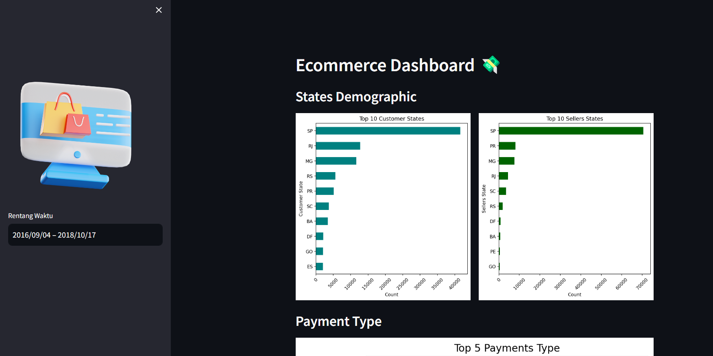

# Dicoding Ecommerce Dashboard
Proyek ini merupakan tugas akhir dari program analisis data yang diadakan oleh Dicoding dalam kelas ID Camp 2023 Data Science. Dalam proyek ini, peserta memiliki opsi untuk memilih salah satu dari tiga dataset yang disediakan, dan saya telah memilih dataset e-commerce sebagai fokus analisis.

## Setup environment
```
conda create --name main-ds python=3.9
conda activate main-ds
pip install pandas matplotlib streamlit
```

## Run steamlit app
```
python -m streamlit run dashboard.py 
```

## Dashboard Link
pd-dashboard-dicoding-ds.streamlit.app

## Screenshot Dashboard
